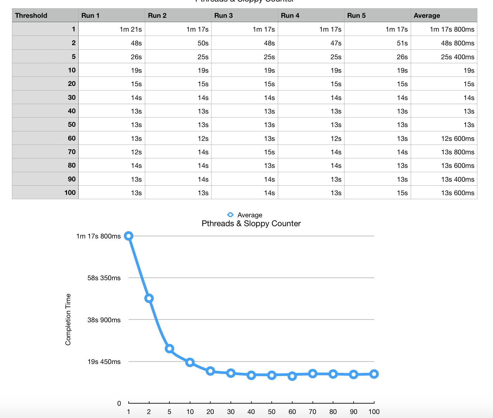

# pthreads
Challenge: Create C program that uses Pthreads/Sloppy Counter to show how the accuracy changes depending on the threshold.

Bash script included that will run the program enough times to create data for the chart below.

